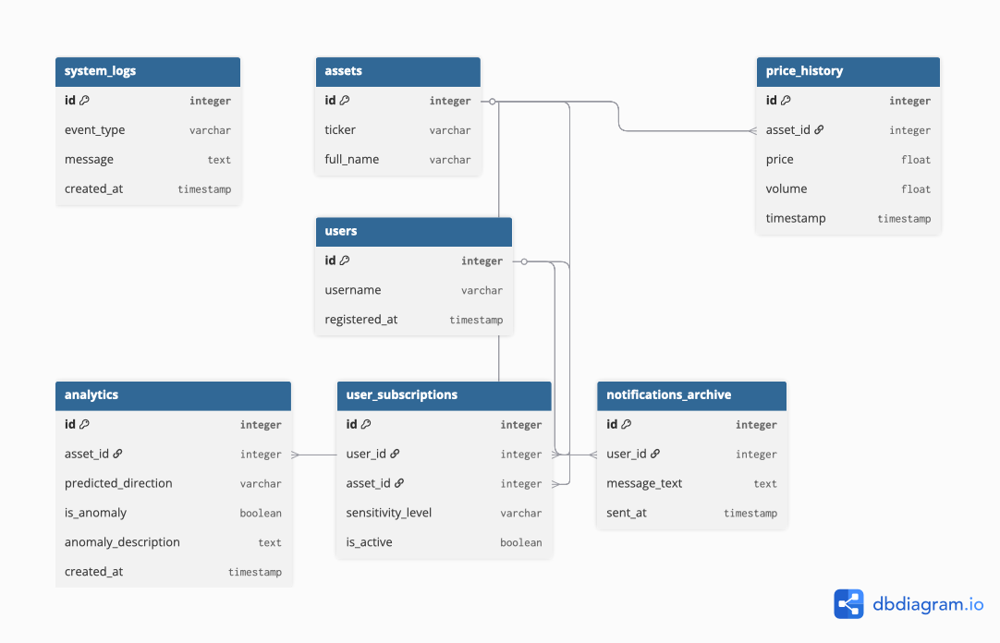

# Подробный процесс разработки

## Целевая аудитория
* Трейдеры и инвесторы, которым важно оперативно узнавать о движении монет

## Задачи системы
* Автоматический сбор цен
* Анализ аномалий на рынке
* Уведомление пользователей

## Описание процесса
* **Вход:** API биржи
* **Механизм:** Python + ML
* **Выход:** Telegram

## Схема базы данных
