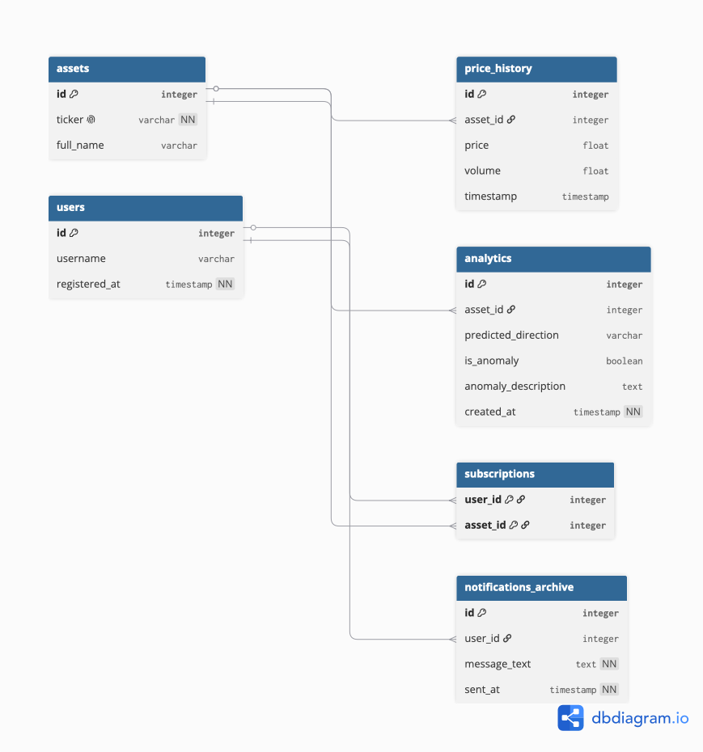

# Отчёт по проектной работе
## Дисциплина: Базы данных
## Тема: Разработка базы данных для автоматизации системы мониторинга рыночных аномалий криптовалют

---

## 1. Описание целевой аудитории и её задач

Разрабатываемая база данных спроектирована для автоматизации процессов алготрейдинга, крипто-аналитики и оперативного риск-менеджмента волатильности активов.

### Целевая аудитория (ЦА):
* **Краткосрочные трейдеры (Скальперы):** Пользователи, совершающие сделки внутри дня, для которых критична скорость реакции на резкие изменения котировок.
* **Крипто-аналитики (Data Scientists):** Специалисты, собирающие исторические данные для поиска закономерностей, тестирования торговых гипотез и обучения моделей.
* **Пассивные инвесторы:** Пользователи, желающие оперативно зайти в актив по выгодной цене в момент сильного пролива рынка (дампа) или вовремя выйти при резком взлете (пампе).

### Типовые задачи аудитории, решаемые базой данных:
* **Агрегация исторических данных:** Хранение непрерывной ленты котировок с биржи без необходимости повторного обращения к внешним API (`price_history`).
* **Фильтрация рыночного шума:** Автоматическое выделение периодов высокой волатильности и математических аномалий тренда (`analytics`).
* **Персонализация уведомлений:** Управление индивидуальными подписками пользователей на конкретные торговые пары, чтобы исключить спам лишней информацией (`subscriptions`).
* **Обеспечение отказоустойчивости и аудит:** Логирование фактов отправки сообщений для контроля качества доставки сигналов в реальном времени (`notifications_archive`).

---

## 2. Существующие аналоги на рынке ПО

На рынке существуют решения для мониторинга котировок, однако каждое из них имеет свои архитектурные особенности:

1. **TradingView:**
   * *Преимущества:* Огромный выбор индикаторов, гибкие графики.
   * *Недостатки:* Высокая стоимость платной подписки для бесперебойных алертов, сложность интеграции «из коробки» с Telegram для обычного пользователя.
2. **CoinMarketCap / CoinGecko:**
   * *Преимущества:* Простота настройки базовых уведомлений в мобильном приложении.
   * *Недостатки:* Высокая задержка данных, составляющая от 30 секунд до нескольких минут. Нет возможности отслеживать микро-аномалии на уровне нескольких секунд.
3. **Разработанное решение:**
   * *СУБД:* SQLite3
   * *Преимущества:* Минимальный пинг за счёт прямого асинхронного подключения к бирже Kraken по протоколу CCXT. Полный контроль над данными пользователей и историей цен внутри одной локальной БД без сторонних подписок.

---

## 3. Описание реализуемого процесса в нотациях IDEF0

Для описания функциональной структуры системы автоматизации мониторинга аномалий используется методология структурного анализа **IDEF0**.

### Контекстная диаграмма А0: «Мониторинг рыночных аномалий»
* **Вход:** Сырой поток тикеров и котировок с биржи (Kraken API: цена, объем, время).
* **Управление:** Правила детекции аномалий (алгоритм пересечения скользящих средних, установленный процентный порог волатильности `0.01%`).
* **Механизмы:** Программный комплекс на Python (библиотеки `ccxt`, `aiogram`), СУБД `SQLite3`, вычислительные мощности (MacBook Air).
* **Выход:** Записи в архивных таблицах базы данных, мгновенные интерактивные уведомления пользователей в Telegram-боте.

### Диаграмма декомпозиции А1:
Процесс автоматизации разделен на 3 тесно связанных функциональных блока:
1. **Блок 1: Сбор и архивация данных (`collector.py`):** Принимает данные из API биржи и транслирует их в таблицу `price_history`.
2. **Блок 2: Математический анализ тренда (`analyzer.py`):** Запрашивает срез последних 5 цен из `price_history`, рассчитывает быструю и медленную скользящие средние ($MA$), выставляет флаг `is_anomaly` и записывает результат в таблицу `analytics`.
3. **Блок 3: Маршрутизация и отправка уведомлений (`bot_main.py`):** Реагирует на триггер аномалии, сопоставляет ID актива со списками из таблицы `subscriptions`, рассылает сообщения в Telegram и делает запись в `notifications_archive`.

---

## 4. Схема данных (ER-диаграмма)

Реляционная модель состоит из 6 логически связанных таблиц. Связи типа «Один со многими» (`1:M`) и «Многие со многими» (`M:N`) реализованы через внешние ключи (`Foreign Keys`) с поддержкой каскадного удаления (`ON DELETE CASCADE`).



---

## 5. Структура базы данных

```sql
PRAGMA foreign_keys = ON;

-- 1. Справочник отслеживаемых монет
CREATE TABLE IF NOT EXISTS assets (
    id INTEGER PRIMARY KEY AUTOINCREMENT,
    ticker TEXT UNIQUE NOT NULL,
    full_name TEXT
);

-- 2. История тиков цен с биржи
CREATE TABLE IF NOT EXISTS price_history (
    id INTEGER PRIMARY KEY AUTOINCREMENT,
    asset_id INTEGER,
    price REAL,
    volume REAL,
    timestamp TEXT,
    FOREIGN KEY (asset_id) REFERENCES assets(id) ON DELETE CASCADE
);

-- 3. Зарегистрированные пользователи Telegram
CREATE TABLE IF NOT EXISTS users (
    id INTEGER PRIMARY KEY,
    username TEXT,
    registered_at TEXT NOT NULL
);

-- 4. Матрица подписок (Связь Многие-со-Многими)
CREATE TABLE IF NOT EXISTS subscriptions (
    user_id INTEGER,
    asset_id INTEGER,
    PRIMARY KEY (user_id, asset_id),
    FOREIGN KEY (user_id) REFERENCES users(id) ON DELETE CASCADE,
    FOREIGN KEY (asset_id) REFERENCES assets(id) ON DELETE CASCADE
);

-- 5. Журнал результатов анализа волатильности и трендов
CREATE TABLE IF NOT EXISTS analytics (
    id INTEGER PRIMARY KEY AUTOINCREMENT,
    asset_id INTEGER,
    predicted_direction TEXT,
    is_anomaly BOOLEAN,
    anomaly_description TEXT,
    created_at TEXT NOT NULL,
    FOREIGN KEY (asset_id) REFERENCES assets(id) ON DELETE CASCADE
);

-- 6. Архив успешно отправленных пуш-уведомлений
CREATE TABLE IF NOT EXISTS notifications_archive (
    id INTEGER PRIMARY KEY AUTOINCREMENT,
    user_id INTEGER,
    message_text TEXT NOT NULL,
    sent_at TEXT NOT NULL,
    FOREIGN KEY (user_id) REFERENCES users(id) ON DELETE CASCADE
);
```

---

## 6. Программная структура проекта

После проектирования базы данных была сформирована модульная структура приложения. Главная идея архитектуры — разделить сбор данных, анализ, работу с БД и пользовательский интерфейс Telegram-бота на независимые компоненты.

### Основные директории и файлы:
* **`src/config.py`:** Загружает переменные окружения из `.env`, хранит `BOT_TOKEN`, `ADMIN_ID` и путь к SQLite-базе данных.
* **`src/database/schema.py`:** Создаёт физическую структуру БД: таблицы активов, истории цен, пользователей, подписок, аналитики и архива уведомлений.
* **`src/database/seed.py`:** Выполняет первичное наполнение таблицы `assets` списком торговых пар.
* **`src/database/db_manager.py`:** Содержит функции доступа к данным. Через него остальные части системы получают активы, цены, подписчиков и сохраняют результаты аналитики.
* **`src/data_collector/collector.py`:** Подключается к Kraken через библиотеку `ccxt`, получает котировки, сохраняет их в `price_history`, запускает анализ и отправляет уведомления подписчикам.
* **`src/analytics/analyzer.py`:** Выполняет расчёт краткосрочного тренда на основе последних сохранённых цен.
* **`src/bot/`:** Отвечает за пользовательское взаимодействие в Telegram.

Такое разделение снижает связность кода: изменение алгоритма анализа не требует переписывания интерфейса бота, а изменение кнопок Telegram не влияет на структуру базы данных.

---

## 7. Реализация Telegram-бота

Telegram-бот реализован на библиотеке **aiogram 3**. Первоначально логика бота находилась в одном файле, но по мере роста функциональности она была разделена на несколько модулей.

### Структура модуля `src/bot/`:
* **`bot_main.py`:** Точка входа Telegram-бота. Создаёт объект `Bot`, объект `Dispatcher`, подключает роутер обработчиков и запускает polling.
* **`handlers.py`:** Содержит обработчики команд, callback-запросов и текстовых кнопок.
* **`keyboards.py`:** Описывает постоянное меню снизу и inline-кнопки для быстрой навигации.
* **`messages.py`:** Хранит текст справки и функцию формирования приветственного сообщения.

### Поддерживаемые команды:
* **`/start`:** Регистрирует пользователя в таблице `users` и показывает главное меню.
* **`/status`:** Показывает последние сохранённые котировки по всем активам из таблицы `price_history`.
* **`/subscribe`:** Открывает список активов, на которые пользователь ещё не подписан.
* **`/unsubscribe`:** Показывает активные подписки пользователя и позволяет удалить выбранную.
* **`/subscriptions`:** Выводит список текущих подписок пользователя.
* **`/help`:** Показывает справочную информацию по возможностям бота.

### Быстрая навигация:
Для повышения удобства пользователя были добавлены два вида кнопок:
1. **Reply-клавиатура:** Постоянное меню снизу с действиями "Статус рынка", "Мои подписки", "Подписаться", "Отписаться" и "Помощь".
2. **Inline-клавиатуры:** Кнопки внутри сообщений для обновления статуса, перехода к подпискам и возврата в главное меню.

Это позволяет пользователю работать с ботом без ручного ввода команд и снижает вероятность ошибок при взаимодействии.

---

## 8. Связь Telegram-бота с базой данных и сборщиком

Бот не работает с SQLite напрямую через SQL-запросы. Все операции выполняются через слой `db_manager.py`, который выступает единым интерфейсом доступа к данным.

### Основные операции бота с БД:
* **Регистрация пользователя:** `add_user()` добавляет Telegram ID и username в таблицу `users`.
* **Получение списка активов:** `get_all_assets()` используется при построении меню подписки и статуса рынка.
* **Получение последней цены:** `get_last_price()` применяется в команде `/status`.
* **Управление подписками:** `add_subscription()`, `remove_subscription()` и `get_user_subscriptions()` работают с таблицей `subscriptions`.

### SQL-запросы, используемые ботом:

1. **Регистрация пользователя при команде `/start`:**

```sql
INSERT OR IGNORE INTO users (id, username, registered_at)
VALUES (?, ?, ?);
```

Данный запрос добавляет нового пользователя Telegram в таблицу `users`. Конструкция `INSERT OR IGNORE` предотвращает ошибку при повторном запуске команды `/start`, если пользователь уже был зарегистрирован ранее.

2. **Получение списка всех отслеживаемых активов:**

```sql
SELECT id, ticker
FROM assets;
```

Запрос применяется при построении меню подписки и при формировании статуса рынка. Бот получает внутренний `id` актива и его тикер, который отображается пользователю.

3. **Получение последней сохранённой цены актива:**

```sql
SELECT price, volume, timestamp
FROM price_history
WHERE asset_id = ?
ORDER BY id DESC
LIMIT 1;
```

Запрос используется в команде `/status`. Сортировка по `id DESC` позволяет получить последнюю запись истории цен для конкретного актива.

4. **Поиск актива по тикеру перед оформлением подписки:**

```sql
SELECT id
FROM assets
WHERE ticker = ?;
```

Перед добавлением подписки бот проверяет, существует ли выбранный тикер в справочнике `assets`. Это защищает таблицу `subscriptions` от ссылок на несуществующие активы.

5. **Добавление подписки пользователя на актив:**

```sql
INSERT OR IGNORE INTO subscriptions (user_id, asset_id)
VALUES (?, ?);
```

Связь пользователя и актива сохраняется в таблице `subscriptions`. Так как пара `(user_id, asset_id)` является составным первичным ключом, повторная подписка на тот же актив не создаёт дубликат.

6. **Получение списка подписок пользователя:**

```sql
SELECT a.ticker
FROM subscriptions s
JOIN assets a ON s.asset_id = a.id
WHERE s.user_id = ?;
```

Запрос используется командами `/subscriptions`, `/unsubscribe` и меню подписки. Соединение таблиц `subscriptions` и `assets` позволяет показать пользователю понятные тикеры вместо внутренних идентификаторов.

7. **Удаление подписки пользователя:**

```sql
DELETE FROM subscriptions
WHERE user_id = ? AND asset_id = ?;
```

Запрос выполняется при выборе актива в меню отписки. После удаления бот обновляет сообщение с текущим списком оставшихся подписок.

Сборщик данных также связан с ботом: при обнаружении аномалии `collector.py` получает список подписчиков через `get_subscribers()` и отправляет сообщение через объект `bot`, импортированный из `src.bot.bot_main`.

Таким образом, общая цепочка работы выглядит следующим образом:

```text
Kraken API
    ↓
collector.py
    ↓
price_history
    ↓
analyzer.py
    ↓
analytics
    ↓
subscriptions
    ↓
Telegram уведомление пользователю
    ↓
notifications_archive
```

---

## 9. Алгоритм обнаружения аномалий

В текущей версии проекта используется простой математический подход, достаточный для учебного прототипа:
* Берутся последние 5 цен актива из таблицы `price_history`.
* Рассчитывается процентное изменение между первой и последней ценой в этом окне.
* Если изменение по модулю превышает порог `0.01%`, событие считается аномальным.
* Дополнительно рассчитываются две скользящие средние:
  * Быстрая MA — среднее значение по двум последним ценам.
  * Медленная MA — среднее значение по пяти последним ценам.
* Если быстрая MA выше медленной, направление определяется как `PUMP`.
* Если быстрая MA ниже медленной, направление определяется как `DUMP`.
* При равенстве средних направление определяется как `STABLE`.

Результат анализа сохраняется в таблицу `analytics`, что позволяет в будущем строить отчёты, проверять качество сигналов и развивать алгоритм.

---

## 10. Команды запуска проекта

Для удобства разработки используется `Makefile`.

```bash
make init       # Создание таблиц базы данных
make seed       # Первичное наполнение таблицы assets
make bot        # Запуск Telegram-бота
make collector  # Запуск сборщика рыночных данных
make clean      # Очистка __pycache__
```

Перед запуском необходимо создать файл `.env` в корне проекта и указать токен Telegram-бота:

```env
BOT_TOKEN=your_telegram_bot_token
ADMIN_ID=your_telegram_id
```

Для полноценной работы системы обычно запускаются два процесса: Telegram-бот и сборщик данных. Бот отвечает за пользовательский интерфейс, а сборщик постоянно обновляет котировки и инициирует отправку алертов.

---

## 11. Тестирование и TDD

Для проверки корректности проекта используется автоматическое тестирование на базе `pytest`. Тесты вынесены в отдельную директорию `tests/`, а запуск выполняется командой:

```bash
make test
```

### Принципы тестирования

В проекте используются два уровня проверок:
* **Модульные тесты:** проверяют отдельные функции изолированно от внешней среды. Например, `tests/test_analyzer.py` тестирует алгоритм `analyze_market_trend()` как чистую функцию: на вход передается список цен, а база данных в этих тестах не используется.
* **Интеграционные тесты:** проверяют совместную работу нескольких модулей. Например, `tests/test_db_manager.py` создаёт временную SQLite-базу, инициализирует схему через `schema.db_init()` и затем проверяет функции `db_manager.py` на реальных SQL-операциях.

### Что покрывают текущие тесты

* недостаток истории цен возвращает нейтральный прогноз;
* рост цены определяется как `PUMP` и аномалия;
* падение цены определяется как `DUMP` и аномалия;
* стабильная цена определяется как `STABLE`;
* сборщик получает последние цены через слой БД и передаёт список цен в анализатор;
* подписка пользователя создаётся, читается и удаляется;
* подписка на несуществующий тикер отклоняется;
* история цен сохраняется и возвращается в хронологическом порядке;
* записи аналитики и архива уведомлений сохраняются в базе данных.

### Использование fixtures и параметризации

Для повторно используемых тестовых данных применяются `pytest fixtures`: временная база данных, тестовый пользователь и тестовый актив создаются один раз на тестовый сценарий и не затрагивают рабочий файл `data/crypto_bot.sqlite`.

Для проверки разных рыночных сценариев используется параметризация `pytest.mark.parametrize`. Это позволяет одним тестом проверить несколько вариантов поведения алгоритма: `PUMP`, `DUMP` и `STABLE`.

### Подход TDD

При добавлении новой функциональности можно использовать цикл TDD:
1. Сначала описать ожидаемое поведение в тесте.
2. Запустить тесты и убедиться, что новый тест падает.
3. Реализовать минимальный код, который делает тест проходящим.
4. Запустить весь набор тестов.
5. Провести рефакторинг без изменения внешнего поведения.

Такой подход особенно полезен для будущих задач проекта: FastAPI-эндпоинтов состояния бота, загрузки исторических OHLCV-данных и ML-прогноза направления цены.
